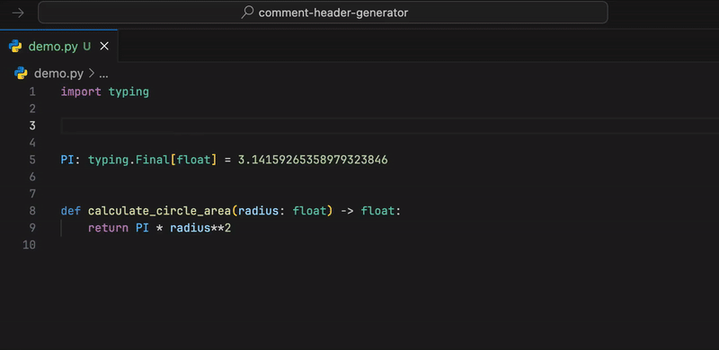

# Comment Header Generator


A Visual Studio Code extension that helps you create beautifully formatted comment headers and dividers with a single command. It's fully customizable and supports any language or comment style you can imagine!

## Features

- Create single-line or multi-line comment headers with custom text
- Automatically format comments based on the current language
- Support for multiple comment styles (C-style, Shell/Python-style, SQL-style)
- Text formatting options (camelCase, PascalCase, snake_case, kebab-case, capitalize, etc.)
- Automatic indentation handling
- Automatic multi-line selection support
- **Complete customization** - create your own comment styles from scratch!



## Usage

1. Select text (optional) or place cursor where you want to insert a comment
2. Right-click and select "Wrap in Comment Block" from context menu, or:
3. Open the command palette (`Ctrl+Shift+P` or `Cmd+Shift+P`) and type "Wrap in Comment Block"
4. If no text is selected, you'll be prompted to enter comment text
5. Choose the comment style if multiple options are available

## Default Language Support

The extension comes with pre-configured comment styles for many languages, but **you can add support for any language** by customizing the settings:

- **C-style comments (`/`)**: JavaScript, TypeScript, Java, C, C++, C#, Go, Rust, JSON, etc.
- **Hash comments (`#`)**: Python, Ruby, Bash, Shell scripts, etc.
- **Dash comments (`-`)**: SQL, MySQL, PLSQL, TSQL, etc.

PHP supports both C-style and hash comments.

## Examples

### Single Line Comments

```javascript
// This is a comment header ----------------------------------------------------
```

```python
# This is a comment header -----------------------------------------------------
```

```sql
-- This is a comment header ----------------------------------------------------
```

### Multi-line Comments

```javascript
/******************************************************************************
 *                          This is a comment header                          *
 ******************************************************************************/
```

```python
################################################################################
#                           This is a comment header                           #
################################################################################
```

```sql
--------------------------------------------------------------------------------
--                          This is a comment header                          --
--------------------------------------------------------------------------------
```

## Customization Guide

This extension is **completely modular and customizable**. You can:

- Create new comment styles from scratch
- Modify or replace the default styles
- Add support for new languages
- Customize every aspect of the comment generation

### How Configuration Works

The extension uses two main configuration settings:

1. `commentHeaderGenerator.commentStyles` - Defines the available comment styles
2. `commentHeaderGenerator.languageMapping` - Maps languages to specific comment styles

You can completely replace these settings with your own custom configurations.

### Creating Custom Comment Styles

You can use **any identifier** for your comment styles, not just the default ones. For example:

```json
"commentHeaderGenerator.commentStyles": {
  // You can modify or replace the default styles
  "/": { /* C-style comments */ },
  "#": { /* Hash comments */ },
  "-": { /* SQL comments */ },

  // Or create entirely new styles with any identifiers you want
  "hearts": {
    "Heart Border": {
      "width": 80,
      "lines": [
        [
          { "type": "segment", "text": "/* " },
          { "type": "filler", "text": "♥ " },
          { "type": "segment", "text": "*/" }
        ],
        [
          { "type": "segment", "text": "/* " },
          { "type": "selection" },
          { "type": "segment", "text": " */" }
        ],
        [
          { "type": "segment", "text": "/* " },
          { "type": "filler", "text": "♥ " },
          { "type": "segment", "text": "*/" }
        ]
      ]
    }
  },
  "banner": {
    "Banner Style": {
      "width": 80,
      "lines": [
        [
          { "type": "segment", "text": "/**" },
          { "type": "filler", "text": "*" }
        ],
        [
          { "type": "segment", "text": " * " },
          { "type": "selection", "format": "capitalize" },
          { "type": "filler", "text": " " }
        ],
        [
          { "type": "filler", "text": "*" },
          { "type": "segment", "text": "**/" }
        ]
      ]
    }
  }
}
```

Then map languages to your custom styles:

```diff
"commentHeaderGenerator.languageMapping": {
  // You can modify the default mappings
- "javascript": "/",
+ "javascript": ["/", "hearts", "banner"],
}
```

```json
"commentHeaderGenerator.languageMapping": {
  // Add mappings for any language to any style
  "markdown": ["hearts", "banner"],
  "html": "banner",
  "css": "banner"
}
```

### Detailed Configuration Options

#### Comment Style Definition

Every comment style consists of:

1. **Style Identifier** (e.g., "/", "#", "-", or any custom name)
2. **Style Templates** (e.g., "Single Line", "Multi Line", or any custom name)
3. **Template Configuration**:
   - `width`: Total width of the comment (default: 80)
   - `subtractIndentationWidth`: Whether to subtract indentation from width (default: false)
   - `lines`: Array of line definitions, each containing content elements

#### Content Elements

There are three types of elements you can use in your comment styles:

1. **Segment** - Static text like comment markers:

   ```json
   { "type": "segment", "text": "// " }
   ```

2. **Selection** - The text being wrapped (user's selected text or input):

   ```json
   { "type": "selection" }
   ```

   With optional formatting:

   ```json
   { "type": "selection", "format": "capitalize" }
   ```

   If no format is specified, the text remains unchanged. Available formats:

   - `camel`: camelCaseFormatting
   - `pascal`: PascalCaseFormatting
   - `snake`: snake_case_formatting
   - `kebab`: kebab-case-formatting
   - `upper`: UPPERCASE FORMATTING
   - `lower`: lowercase formatting
   - `capitalize`: Capitalize Each Word

3. **Filler** - Characters that fill remaining space:

   ```json
   { "type": "filler", "text": "-" }
   ```

   With optional weight for space distribution:

   ```json
   { "type": "filler", "text": "=", "weight": 2 }
   ```

#### Advanced Filler Options

**Multi-Character Fillers**:

```json
{ "type": "filler", "text": "-*-" }
```

**Weighted Fillers** (for distributing space proportionally):

```json
[
  { "type": "filler", "text": "=", "weight": 2 },
  { "type": "filler", "text": "-", "weight": 1 }
]
```

#### Indentation Handling

To preserve document indentation and factor it into the comment width:

```json
{
  "width": 80,
  "subtractIndentationWidth": true,
  "lines": [
    /* ... */
  ]
}
```

### Example: Box Comment Style

Here's a complete example of creating a box-style comment:

```json
"commentHeaderGenerator.commentStyles": {
  "box": {
    "Box Style": {
      "width": 80,
      "lines": [
        [
          { "type": "segment", "text": "┌" },
          { "type": "filler", "text": "─" },
          { "type": "segment", "text": "┐" }
        ],
        [
          { "type": "segment", "text": "│ " },
          { "type": "selection" },
          { "type": "filler", "text": " " },
          { "type": "segment", "text": " │" }
        ],
        [
          { "type": "segment", "text": "└" },
          { "type": "filler", "text": "─" },
          { "type": "segment", "text": "┘" }
        ]
      ]
    }
  }
}
```

And mapping it to a language:

```json
"commentHeaderGenerator.languageMapping": {
  "markdown": "box"
}
```

### Edge Cases

- **No text selected or entered**: The extension will create a comment with empty content.
- **No format specified**: If no format is provided for a selection, the text is used as-is.
- **Comment width too small**: If the width is insufficient, an error is shown.
- **Unknown language**: If a language isn't in the mapping, the extension shows all available styles.

## License

MIT

## Author

[André Freire](https://github.com/anfreire)

## Contribute

Feedback and contributions are welcome! Please check out the [repository](https://github.com/anfreire/Comment-Header-Generator).
